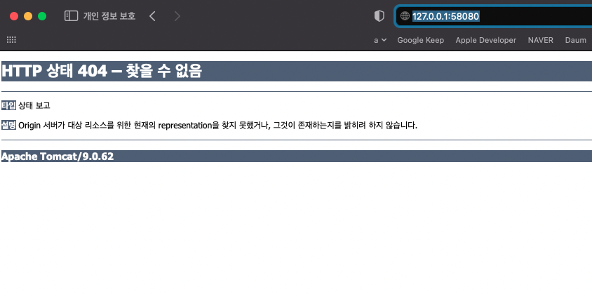
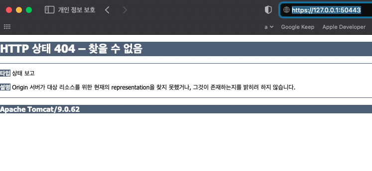

# Nginx docker container
Nginx와 tomcat 컨테이너 2개를 만들어서 이 2개의 컨테이너가 서로 통신하게 만들어 보자.

## Prerequisites
1. Docker container들간 통신을 위해 subnet을 하나 생성한다. 
    - **`subnet`을 이미 생성해 두었다면 이 단계는 건너뛰어도 된다.**   
    - 다음 커맨드로 `testnet`이라는 subnet을 생성하자.
        ```bash
        docker network create --subnet=172.31.0.0/16 testnet
        ```

    - 커맨드와 실행 결과
        ```bash
        ➜ docker network create --subnet=172.31.0.0/16 testnet
        e79d9cd0c6ec405e43249379e4e380ec0b1e645d9033c6dc3bf6a5624e0e63ba
        ```

    - 생성한 네트워크 확인하기. testnet이라는 네트워크가 생성되었는지 확인한다.
        ```bash
        ➜ docker network ls
        NETWORK ID     NAME      DRIVER    SCOPE
        4925f536edb3   bridge    bridge    local
        6470dc5298d7   host      host      local
        b816cad8e85e   none      null      local
        e79d9cd0c6ec   testnet   bridge    local
        ```

2. tomcat container 실행하기
    - nginx container를 프록시 서버로 설정하여 nginx로 들어오는 요청을 tomcat으로 보내도록 만들어 보기 위해 tomcat container를 만들자.
        ```bash
        docker run -it --rm -p 58080:8080 \
            --net testnet --ip 172.31.0.3 \
            tomcat:9.0
        ```

3. 사설 인증서 생성하기
    - proxy/ssl 경로 안에서 openssl을 이용해서 사설 인증서를 만들자.
        ```bash
        openssl req -x509 -nodes -days 365 -newkey rsa:2048 -keyout ./proxy/ssl/server.key -out ./proxy/ssl/server.crt
        ```

    - 브라우저에서 접속해 보자. 404 오류가 나는데 돌어가고 있는 앱이 없기 때문에 그런 것 같다. 일단 tomcat은 작동중인 것을 확인했으니 넘어가자.
        

## Nginx docker-compose.yml 파일 만들기
1. docker-compose.yml 파일을 만들어 다음과 같은 내용을 추가한다.
    ```yml
    version: '3'
    services:
    myproxy:
        image: nginx:1.18.0
        ports:
        - "50443:443"
        volumes:
        - ./proxy/nginx.conf:/etc/nginx/nginx.conf
        - ./proxy/ssl:/opt/ssl
        - ./proxy/logs:/var/log/nginx
        - /etc/localtime:/etc/localtime:ro
        restart: always
        networks:
        mynet:
            ipv4_address: 172.31.0.2

    networks:
    mynet:
        external:
        name: testnet
    ```

2. nginx에 접속해 보자. tomcat에 직접 접속했던 것과 같은 화면이니 성공이다.(404 오류지만...)   
    

3. `yml` 설명
    - `services.myproxy.image: nginx:1.18.0`
        - 어떤 docker image를 사용할건지
    - `services.myproxy.ports`
        - 호스트 포트와 컨테이너 포트를 매핑한다. `50443:443`은 호스트의 50443 포트로 접속하면 컨테이너의 443으로 포워딩한다는 의미이다.
    - `services.myproxy.volumes`
        - 호스트의 지정 파일 혹은 폴더를 컨테이너의 폴더와 매핑한다. 이를 통해 컨테이너가 삭제되어도 해당 파일을 영구적으로 유지할 수 있다.
    - `services.myproxy.networks.mynet.ipv4_address` 
        - container에 지정할 IP